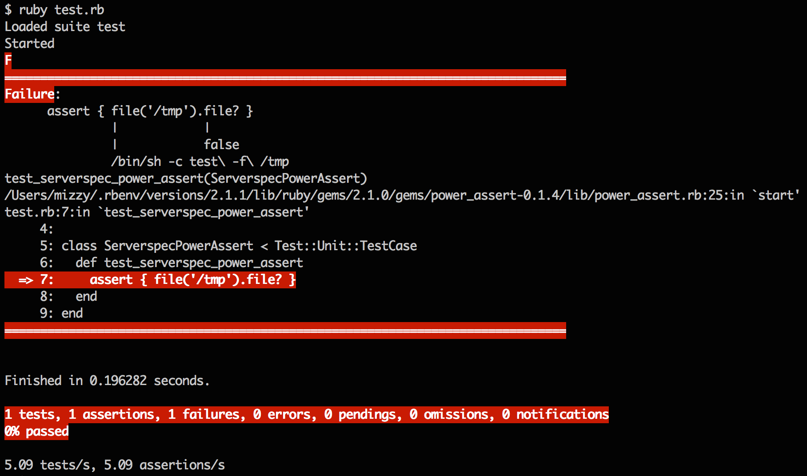

# Serverspec

---

# 自己紹介

* 宮下 剛輔
* mizzy, @gosukenator
* フリーランスのソフトウェアエンジニア

---

# Serverspec とは何か

* RSpec でサーバのテストを行うためのツール

---

# Serverspec のコード例

```ruby
describe package('serverspec') do
  it { should be_installed.by('gem').with_version('2.24.1') }
end
```

----

# Serverspec のコード例

power-assert 版


```ruby
assert { package('serverspec').installed?('gem', '2.24.1') }
```

---


# 生み出された経緯

---

# 2006年

* 当時の職場では Word で書かれた手順書に基づいて手動でサーバ構築してた
* Puppet を導入した
* 構築は自動化されたけど、構築後のテストはExcelのチェックシートに目視確認した結果を記述
* 結果をプリントアウトして上長に提出、印鑑を押してもらう

---

# 2007年

* Assurer というツールをつくりはじめた
* Perl製
* TAP (Test Anything Protocol) で結果出力

---

# Assurer

* Plagger っぽさ（プラグイン、YAMLで設定）
* Serverspecとは違い外部から振舞をテスト
* テスト駆動サーバ構築

---

# Assurerの失敗

* 悪い意味で Plagger の影響を引きずっている
  * テストしたい内容は YAML で記述
  * プラグインも種類が無駄にある
    * Filter, Format, Notify, Publish, Test
* 無駄に高機能
  * ジョブキューを利用した分散実行とかも実装してた

---
# Assurerの失敗（つづき）

* TAP で出力すること以外は Perl プログラムのテストの書き方とは異なる
* 振舞のテストは状態のテストより面倒
* 作者本人が使うのめんどくさくなった
* そのうち忘れ去られた

---

# 2013年

* 自分が書いたPuppetマニフェストをリファクタリングしたくなった
* リファクタと言えばテストが必要
* rspec-puppet は用途に合わない

---

# 2013年（つづき）

* そう言えば hiboma が Sqale のコンテナ構築のテストを RSpec でやってた
* それを真似してもう少し汎用的なサーバテストフレームワークつくったら良さそう
* Serverspec 誕生

---

# Assurer と Serverspec の思想の違い

* Assurer はサーバのテストを自動化したいからつくった
* Serverspec はインフラコードのリファクタリングをしたいからつくった

---

# Serverspec の位置づけ

* Infrastructure as Code を実現するための一ツール
* Infrastructure as Code とは「ソースコードリポジトリ・アプリケーションデータのバックアップ・サーバリソースからビジネスを復旧できるようにすること」

---

# RSpec について

---

# なぜ RSpec なのか

* 社内では Ruby のテストは RSpec が標準だった
* その流れで hiboma が RSpec ベースでコンテナのテストをやってた
* その hiboma のやつをベースにつくったので RSpec になった
* なので、特に強いこだわりがあったわけではない

---

# RSpec について思うところ

* One-liner syntax の `should` を好んで使っている
  * `Object#should` は deprecated だけど、One-liner should はまだ deprecated ではないはず
* serverspec.org での説明もすべて One-liner should を使っている
* とは言え、RSpec をそのまま使っているので、Serverspec は RSpec で使える記法はすべて使える

---

# RSpec について思うところ（つづき）

* One-liner should が deprecated になったら RSpec は捨てるかも
  * 記法が変わる、という非本質的なことには振り回されたくない
  * その場合は実験的に一部 power-assert 対応しているのを本格対応

----

# 実装方針

---

# 実装方針

* 導入の敷居を下げる
* ひとつのことをうまくやる
* 他人のために開発しない
* 開放/閉鎖原則

---

# 導入の敷居を下げる

* Assurer が使うハードル高すぎて自分ですら使わなくなったという反省から
* 余計なものをできる限りインストールしない
  * Ruby 1.8.7 サポート
  * エージェントレス
* `serverspec-init` コマンド

---

# 1つのことをうまくやる

* UNIX 哲学
* サーバのテストのみをやる
* 状態のテストのみで振舞のテストはやらない
* テスト対象ホストの管理、テスト用VM操作、サーバ構成管理ツールとの連携等はやらない
* 他のツールで補えるのであればそちらに任せる

---

# 他人のために開発しない

* 自分が使う機能しか実装しない
  * 最初のリリースは、SSH 経由での実行、RedHat 系のみサポート
  * Exec など他のバックエンドを選べる仕組みや、他の OS に対応する仕組みは、他の人が実装してくれた

---

# 他人のために開発しない（つづき）

* GitHub の issue 機能は disable にしている
  * 必要な機能は、それを必要とする人が実装すべき
  * バグも、そのバグで困っている人が直すべき
* 基本的には、自分が使うために開発している、というスタンスを崩さない
  * 燃え尽き防止
  * 知り合いからの要望は対応することはある

---


# 開放/閉鎖原則

* 1つのことをうまくやるだけだと機能不足
* `Rakefile` と `spec_helper.rb` のカスタマイズで対応
* 既存のコードの修正なしに、追加だけで機能拡張できる
* 「他人のために開発しない」ためにも必要

---

# Specinfra

---

# Specinfra

* Serverspec から分離した、汎用コマンド実行フレームワーク
* 実行形式（Exec, SSH, WinRM, Docker など）や、OS 毎のコマンドの違いを吸収するフレームワーク
* Serverspec 以外のテストフレームワークや、サーバ構成管理ツールのベースになることを狙って分離
* Itamae や Serverkit のベースにもなっている

---

# power-assert 対応

---



---

# 今後やりたいこと

---

# 今後やりたいこと

* 実はあまりない
* どう実際の運用に活かしていくか、の方が興味ある
* @sora\_h くんが実装中 の infra\_operator という ベター Specinfra への乗り換え


---

# 参考文献

---

# 参考文献

* O'Reilly Japan - Serverspec
  * http://www.oreilly.co.jp/books/9784873117096/
* 論文「serverspec: 宣言的記述でサーバの状態をテスト可能な汎用性の高いテストフレームワーク」
  * https://github.com/mizzy/serverspec-thesis
